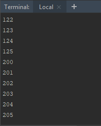
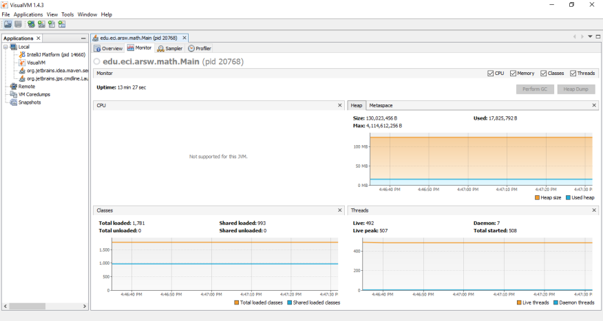

## Part I - Introduction to Java Threads

Se completó el método la clase `CountThread`, esta es la implementación:

```java
public class CountThread extends Thread{

    private int a;
    private int b;

    public CountThread(int a, int b ){
        super();
        this.a=a;
        this.b=b;
    }

    @Override
    public void run() {
        for (int i=a; i<=b;i++){
            System.out.println(i);
        }
    }

}
```

Se completó el método `main` de la clase `CountThreadMain`, esta es la implementación:

```java
public class CountThreadsMain {
    public static void main(String a[]){
        Thread t1= new CountThread(0,99);
        Thread t2= new CountThread(100,199);
        Thread t3= new CountThread(200,299);
        t1.start();
        t2.start();
        t3.start();
    }
}
```

Los resultados al empezar los 3 threads mediante el método `start()` se obtuvo el siguente resultado:


Como se aprecia en la imagen, no existe un orden de ejecución al iniciar los hilos.

## Part II BBP Formula Exercise

Se creo la funcion calcular para hacer la partición y union de los datos que nos retorna el hilo.

```java
public String calcular(int start, int numberOfDigits){
        int step = numberOfDigits / n;
        int remainder = numberOfDigits % n;
        int end;
        StringBuilder digitsBuilder = new StringBuilder();
        for(int i=0;i<n;i++){
            end = start + step;
            if (remainder > 0){ end++; remainder--; }
            piDigitsThread[i] = new DigitThread(start,end-start);
            piDigitsThread[i].start();
            start = end;
        }
        for (int i = 0; i < n ; i++){
            try {
                piDigitsThread[i].join();
                digitsBuilder.append(piDigitsThread[i].getByteAnswer());
            } catch (InterruptedException e) {
                System.err.println("Error " + e.getMessage());
                System.exit(1);
            }
        }
        return digitsBuilder.toString();
    }
```

La parelización se llevo mediante el primer for con la creacion de un arreglo de Threads, en cada uno de estos se repartiran los datos a calcular e iniciar su proceso, despues mediante el segundo for se hace el metodo join() para que cuando finalize cada Thread se agregue la respuesta y poderla retornar.

## Part III Performance Evaluation

1. un Hilo
   
2. Tantos hilos como procesadores
   
3. Tantos hilos como el doble de procesadores
   
4. 200 hilos
   
5. 500 hilos
   
