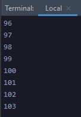
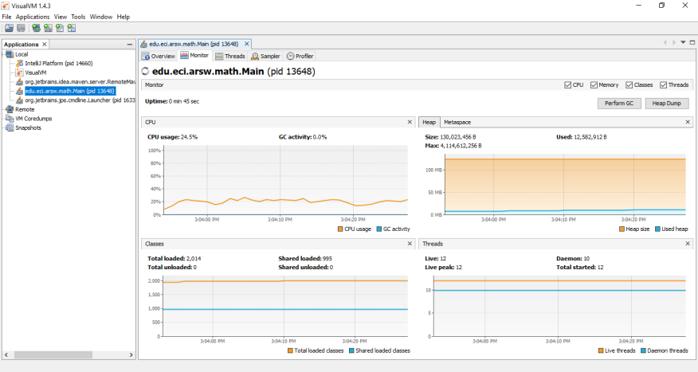
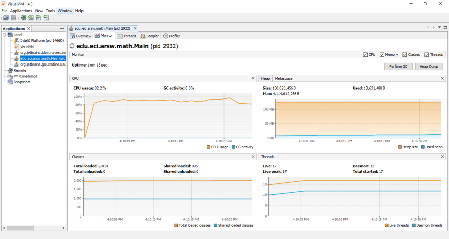
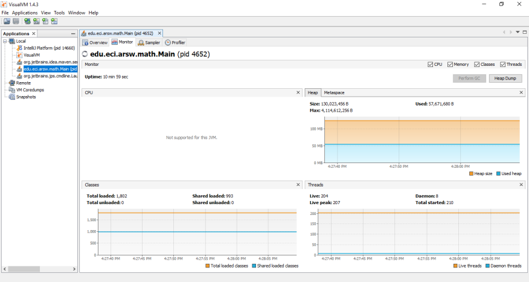

## Compile and run instructions

Entrar al directorio `ARSW-LAB-01/BBP_FORMULA/PARALLELISM-JAVA_THREADS_MAVEN-INTRODUCTION_BBP_FORMULA`

* **Para compilar:** Ejecutar `mvn package`
* **Para ejecutar CountThread:** Ejecutar `mvn exec:java -Dexec.mainClass="edu.eci.arsw.threads.CountThreadsMain"`

* **Para ejecutar PiDigits:** Ejecutar `mvn exec:java -Dexec.mainClass="edu.eci.arsw.math.Main"`

* **Para ejecutar las pruebas:** Ejecutar `mvn test`

## Part I - Introduction to Java Threads

Se completó el método la clase `CountThread`, esta es la implementación:

```java
public class CountThread extends Thread{

    private int a;
    private int b;

    public CountThread(int a, int b ){
        super();
        this.a=a;
        this.b=b;
    }

    @Override
    public void run() {
        for (int i=a; i<=b;i++){
            System.out.println(i);
        }
    }

}
```

Se completó el método `main` de la clase `CountThreadMain`, esta es la implementación:

```java
public class CountThreadsMain {
    public static void main(String a[]){
        Thread t1= new CountThread(0,99);
        Thread t2= new CountThread(100,199);
        Thread t3= new CountThread(200,299);
        t1.start();
        t2.start();
        t3.start();
    }
}
```

Los resultados al empezar los 3 threads mediante el método `start()` se obtuvo el siguiente resultado:


Los resultados al empezar los 3 threads mediante el método `run()` se obtuvo el siguiente resultado:



La salida cambia, esto se debe a que el método `start()` empieza la ejecución del hilo mientras que el método `run()` invoca la función, es decir que se ejecuta en el único hilo (main).

## Part II BBP Formula Exercise

Se creó la función `calcular()` para hacer la partición y union de los datos que nos retornan los hilos.

```java
public class DigitCalculation{
   
    public List<byte[]> calcular(int start, int numberOfDigits){
            List<byte[]> answer = new ArrayList<>();
            int step = numberOfDigits / n;
            int remainder = numberOfDigits % n;
            int end;
            for(int i=0;i<n;i++){
                end = start + step;
                if (remainder > 0){ end++; remainder--; }
                piDigitsThread[i] = new DigitThread(start,end-start);
                piDigitsThread[i].start();
                start = end;
            }
            for (int i = 0; i < n ; i++){
                try {
                    piDigitsThread[i].join();
                    answer.add(piDigitsThread[i].getByteAnswer());
                } catch (InterruptedException e) {
                    System.err.println("Error " + e.getMessage());
                    System.exit(1);
                }
            }
            return answer;
    }
}
```

La paralelización se llevó mediante el primer for con la creación de un arreglo de Threads, en cada uno de estos se repartirán los datos a calcular e iniciar su proceso, después mediante el segundo for se hace el método join() para que cuando finalice cada Thread se agregue la respuesta y poderla retornar.
## Part III Performance Evaluation
A continuación, se muestran los resultados de jVisualVM al realizar el cálculo de un millón de dígitos de PI, sin embargo, no se obtuvo el resultado debido a que el tiempo en ejecución era extenso.

1. Un hilo
   
2. Tantos hilos como procesadores (4)
   
3. Tantos hilos como el doble de procesadores
   
4. 200 hilos
   
5. 500 hilos
   

Para poder responder las preguntas de la sección se limitó la cantidad de dígitos de PI a 50000.
+ **Un hilo**
     + Tiempo: 86.5099263 segundos. 
+ **Tantos hilos como procesadores (4)**
    + Tiempo: 49.2673722 segundos. 
+ **Tantos hilos como el doble de procesadores**
    + Tiempo: 40.2675832 segundos.
+ **200 hilos**
    + Tiempo: 34.801275 segundos.
+ **500 hilos**
    + Tiempo: 35.6599393 segundos.
    
1) Mirando los resultados anteriores, aunque sea una variación de casi un segundo, 
usar doscientos hilos es más efectivo que usar quinientos, esto puede deberse a 
que toca guardar el estado de cada hilo y para cada uno restaurarlo al momento de
su ejecución.

2) Utilizar tantos hilos como el doble de procesadores es más efectivo que 
utilizar la misma cantidad de hilos como cantidad de procesadores. Se realiza un mejor
 uso de los procesadores ya que cada uno puede hacerse cargo de un hilo 
 extra que no implica una gran carga.
 
 3) 
